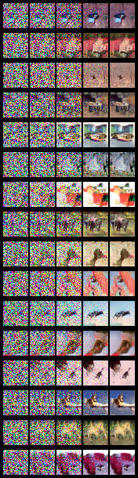
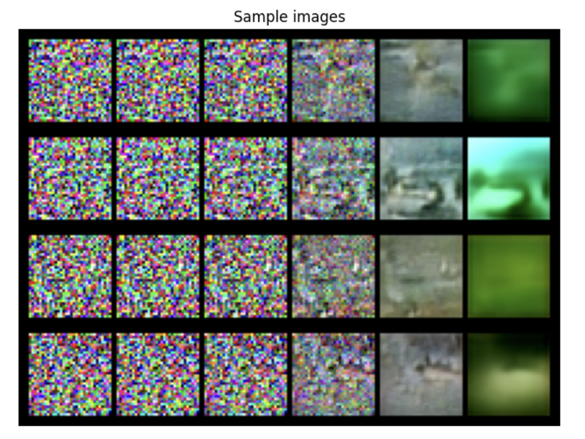

# Introduction

In the rapidly evolving field of machine learning, generative models have gained significant attention for their ability to synthesise realistic data. Among the various architectures, diffusion models have emerged as a powerful technique, leveraging the principles of denoising and probabilistic diffusion. This project focuses on implementing one such advanced diffusion model, the Denoising Diffusion Implicit Model (DDIM), which introduces an efficient sampling strategy and offers flexibility in image generation.

The project's core objective is to explore the capabilities of DDIM, which differentiates itself from earlier models like DDPM (Denoising Diffusion Probabilistic Model) by optimising the sampling process. The model is implemented using PyTorch, emphasising its versatility and scalability in handling large datasets. The CIFAR-10 dataset is chosen for its diversity and complexity, presenting a suitable challenge for the model to demonstrate its ability to generate high-quality images.

This project encompasses several critical steps: implementing the DDIM model, designing appropriate loss functions, and evaluating the generated images using industry-standard metrics like the Inception Score (IS) and Fréchet Inception Distance (FID). Additionally, it explores advanced techniques such as conditional generation, which enables the model to generate images based on specific class labels.

# CIFAR-10 dataset and DataLoader initialisation

## Introduction
Managing and preprocessing datasets efficiently is essential for deep learning workflows. This essay explores the functions provided in the above code to load and preprocess the CIFAR-10 dataset, a widely used benchmark dataset in computer vision.

## Transformations
The function `get_transforms` defines a set of transformations to prepare the dataset for training:

1. **Random horisontal flip**: this transformation flips images horisontally with a 50% probability to augment the dataset by increasing its variability, which helps in generalising the model better.
   
2. **Tensor conversion**: this step converts PIL images to PyTorch tensors, allowing them to be directly processed by deep learning models.
   
3. **Normalisation**: the dataset is normalised to have a mean of 0.5 and a standard deviation of 0.5 across all color channels. This standardisation is crucial for convergence during training.

The transformations are applied sequentially using `transforms.Compose`, which ensures that the dataset is consistently preprocessed before being fed into the model.

## DataLoader creation
The function `create_dataloader` abstracts the PyTorch DataLoader's creation. It initialises the DataLoader with the following parameters:

1. **Shuffle**: if set to `True`, the dataset will be shuffled before each epoch, ensuring that the model sees a new order of examples in each epoch to prevent overfitting.

2. **Drop last**: drops the last incomplete batch if the dataset sised isn't evenly divisible by the batch sised. This ensures all batches have a consistent sised.

3. **Pin memory**: if enabled, DataLoader will pin memory for faster host-to-device data transfer, crucial for accelerating training on GPUs.

4. **Number of workers**: specifies the number of subprocesses to use for data loading. More workers enable parallel data loading, reducing data I/O bottlenecks.

5. **Batch sised**: specifies the number of samples per batch. Larger batches allow for better gradient estimation but require more memory.

## Dataset creation
The function `create_cifar10_dataset` integrates the dataset loading and DataLoader creation:

1. **CIFAR-10 dataset initialisation**: the CIFAR-10 dataset is initialised using the root path, download flag, and training mode. The training mode determines whether to load the training or test set, and the download flag fetches the dataset if not already present.

2. **Transform application**: the transformations defined earlier are applied to each image, ensuring consistent preprocessing.

3. **DataLoader creation**: the dataset is passed through `create_dataloader`, which returns a DataLoader configured with specified parameters, ready for training or evaluation.

The functions provide an efficient and customisable framework for handling the CIFAR-10 dataset in PyTorch. By combining standard transformations, dataset management, and DataLoader creation, they streamline data preprocessing, making it easier for models to be trained effectively.

# Conditional diffusion model for CIFAR-10 dataset

This project implements a conditional diffusion model based on the DDIM (Denoising Diffusion Implicit Models) framework. The model is capable of generating images conditioned on class labels, using a combination of Gaussian diffusion and a UNet-based denoising model.

## Gaussian diffusion trainer

The `GaussianDiffusionTrainer` class is responsible for training the denoising model using Gaussian diffusion. The core of the class lies in the `forward` function, which simulates the diffusion process and calculates the loss.

### Mathematical formulation

The forward function uses the following formulation to generate the noisy version 𝑥𝑡 of the input 𝑥0:

$$
x_t = \alpha_t x_0 + \sqrt{1 - \alpha_t^2} \epsilon
$$

where:

- 𝛼𝑡 is the noise level at timestep t
- 𝜖 is a noise vector sampled from a standard normal distribution

The goal is to train the model to predict the noise 𝜖 given 𝑥𝑡 and 𝑡, using the loss:

$$
{Loss} = \text{MSE}(\epsilon_\theta, \epsilon)
$$

where 𝜖𝜃 is the predicted noise by the model.

### Implementation

- **Initialisation:** the `GaussianDiffusionTrainer` initialises buffers to store the noise schedule, represented by `beta_t`, `signal_rate`, and `noise_rate`.
- **Forward:** during training, the `forward` method generates noisy images 𝑥𝑡 and calculates the mean squared error (MSE) between the predicted and actual noise.

# DDIM sampler

The `DDIM` class implements the sampling strategy for generating images from the diffusion model. It uses a reverse diffusion process based on the trained model to generate images.

### Mathematical formulation

For each sampling step, the sampler computes the previous sample 𝑥𝑡-1 from the current sample 𝑥𝑡 using:

$$
x_{t-1} = \alpha_t' x_t + \beta_t \epsilon_\theta(x_t, t) + \sigma_t \epsilon
$$

where:
- 𝛼′𝑡 is the adjustment factor between timesteps 𝑡 and 𝑡-1
- 𝛽𝑡 and 𝜎𝑡 are noise scaling factors
- 𝜖𝜃(𝑥𝑡,𝑡) is the predicted noise by the model
- 𝜖 is a noise vector sampled from a standard normal distribution

### Implementation

- **Initialisation:** the sampler precomputes and stores alpha and beta values for each timestep.
- **Sampling:** the `forward` method iteratively applies the reverse diffusion step to generate samples starting from a Gaussian noise vector.

# The mathematical framework of DDPM and DDIM: differences and applications

Denoising Diffusion Probabilistic Models (DDPM) and Denoising Diffusion Implicit Models (DDIM) are closely related frameworks in generative AI, primarily for image generation tasks. They share a common origin in the diffusion process but have different characteristics that impact their performance, efficiency, and flexibility. This essay explores the mathematical differences between DDPM and DDIM, focusing on their training processes, sampling efficiency, and denoising strategies.

## Fundamentals of diffusion models

Diffusion models rely on a stochastic process called diffusion, where noise is added incrementally to an initial state, creating a sequence of intermediate states, each progressively noisier than the last. Mathematically, this is described by a series of distributions, starting from a clean data distribution and ending in a noise distribution.

Let 𝑥0 represent the clean data, typically an image. The diffusion process transforms 𝑥0 into a noisy state 𝑥t through a series of time steps T, with Gaussian noise added at each step. The forward diffusion process is defined by a transition probability q(𝑥0 | 𝑥t - 1), where 𝑥t is the state at time step 𝑥t:

$$
q(x_t | x_{t-1}) = \mathcal{N}(x_t; \sqrt{1-\beta_t} \cdot x_{t-1}, \beta_t \cdot I)
$$

denotes a Gaussian distribution with mean 𝜇 and covariance \(\Sigma\), 𝛽𝑡 is the noise schedule at step 𝑡, and 𝐼 is the identity matrix. This represents the addition of Gaussian noise to the previous state, with 𝛽𝑡 controlling the noise variance at each step. The diffusion models are similar to other later variable models, like Flow-Based model, or Hierarchical Variational Autoencoders (VAE), but the main difference is the forward process: in diffusiton models, the forward process is fixed.

## DDPM: training process and reverse diffusion

In DDPM, the training process involves learning to reverse the forward diffusion process by estimating the noise at each step. The reverse diffusion process is defined by p(𝑥t - 1 | 𝑥t), the conditional probability of transitioning from 𝑥t to 𝑥t - 1:

$$
p(x_{t-1} | x_t) = \mathcal{N}(x_{t-1}; \mu_\theta(x_t, t), \Sigma_\theta(x_t, t))
$$

where 𝜇𝜃(𝑥𝑡,𝑡) and Σ𝜃(𝑥𝑡,𝑡) are the mean and covariance estimated by the model at step 𝑡, given the noisy state 𝑥𝑡. The objective is to learn these parameters to effectively reverse the diffusion process and generate a clean image from noise.

### DDPM objective function

The training objective in DDPM involves minimising the difference between the estimated noise and the true noise at each step, typically expressed as a variational bound on the negative log-likelihood of the data:

$$
L = \mathbb{E}_q \sum_{t=1}^T \frac{\beta_t^2}{2\Sigma_t} ||\epsilon_\theta(x_t, t) - \epsilon||^2
$$

where 𝜖𝜃(𝑥𝑡,𝑡) is the estimated noise at step 𝑡, and 𝜖 is the true noise sampled from a Gaussian distribution. The expectation is taken over the forward diffusion distribution q(𝑥𝑡,𝑡), and the objective is to minimised the squared error between the estimated noise and the true noise.

### DDPM sampling process

The sampling process in DDPM involves reversing the forward diffusion process, starting from pure noise and gradually denoising the image. The process begins by sampling from a Gaussian distribution, and then applying the reverse transition probabilities to generate the intermediate states:

$$
x_{t-1} = \mu_\theta(x_t, t) + \Sigma_\theta(x_t, t) \cdot z
$$

where 𝑧 is a standard Gaussian noise term, allowing for stochasticity in the sampling process. This reverse diffusion process requires a large number of steps to ensure high-quality output, typically 1,000 or more, contributing to the computational intensity of DDPM.

## DDIM: implicit sampling and flexible diffusion

DDIM retains much of the structure of DDPM but introduces modifications for faster and more efficient sampling. The implicit nature of the sampling process allows DDIM to generate samples deterministically, reducing the stochasticity associated with traditional diffusion models.

### Implicit sampling in DDIM

DDIM's reverse diffusion process is defined similarly to DDPM, but with a redefined diffusion schedule that allows for flexibility. The reverse transition probability is given by:

$$
x_{t-1} = \sqrt{1 - \alpha_{t-1}} \cdot \mu_\theta(x_t, t) + \sqrt{\alpha_{t-1}} \cdot x_t + \Sigma_\theta(x_t, t) \cdot z
$$

where 𝛼𝑡−1 is a redefined diffusion schedule, and the deterministic component comes from √1−𝛼𝑡−1⋅𝜇𝜃(𝑥𝑡,𝑡). This approach allows for deterministic sampling, which can be useful in scenarios where consistency and efficiency are critical.

### DDIM's denoising strategy

DDIM's denoising strategy introduces flexibility in the reverse diffusion process, allowing for deterministic sampling and redefined diffusion schedules. This strategy enables DDIM to achieve faster sampling efficiency while maintaining high-quality outputs. This flexibility is a key advantage of DDIM, allowing users to adjust the number of sampling steps based on computational resources and desired output quality.

## Conclusion

The main differences between DDPM and DDIM stem from their mathematical structures, training processes, sampling methods, and denoising strategies. DDPM focuses on stable training with accurate noise estimation, leading to high-quality outputs but with high computational demands. DDIM, with its implicit sampling and redefined diffusion schedule, offers greater flexibility and efficiency, allowing for faster sampling with fewer steps.

The choice between DDPM and DDIM depends on the specific requirements of the application. DDPM is ideal for high-fidelity image generation in resource-rich environments, while DDIM is better suited for faster and more efficient generation in resource-constrained contexts. Both models represent significant advancements in the field of diffusion-based generative AI, contributing to the ongoing evolution of techniques for creating complex data from noise.

### Detailed analysis of the UNet model with conditional generation

The code provided implements a conditional UNet model for image generation, including attention mechanisms and residual blocks. Here is a detailed analysis with mathematical insights.

### Timestep embedding function

**TimestepBlockABC**:

An abstract base class to ensure consistent structure in blocks that use timesteps.

**TimestepEmbedSequential**:

Extends `nn.Sequential` to allow layers to accept both the data tensor `x` and the embedding `emb`.

- **inputs**: `timesteps` (timesteps for diffusion), `dim` (dimension for embedding), and `max_period` (maximum period for frequency encoding).
- **outputs**: Embedding tensor representing the time step in a high-dimensional space.
- **process**:
    - calculate half the embedding dimension, **`half`**.
    - compute a range of frequency values using **`torch.exp`**.
    - multiply the timestep values with frequencies to produce sine and cosine waves.
    - concatenate these waves to create the embedding.

**Mathematical formulation**:
The function maps `timesteps` to a high-dimensional embedding space:

$$
{embedding}(t) = \left[ \cos(t \cdot f_i), \sin(t \cdot f_i) \right], \text{ for } i \in [0, \frac{d}{2}]
$$

where:
$$
𝑓𝑖 = [\exp\left(-\frac{i \cdot \log(\text{max ⋅})}{\frac{d}{2}}\right)]
$$

𝑑 is the dimension of the embedding.

### Group normalisation layer

The **`norm_layer`** function:
- creates a GroupNorm layer with 32 groups.
- **inputs**: `channels` (number of channels for normalisation).
- **outputs**: a GroupNorm layer.

**Mathematical formulation**:

$$
{GN}(x) = \frac{x - \mu}{\sigma} \cdot \gamma + \beta
$$

where:
- 𝒙 is the input.
- 𝜇 and 𝜎 are the mean and standard deviation calculated over groups of 32 channels.
- 𝛾 and 𝛽 are learnable scaling and shifting parameters.

### Fused residual block

**FusedResidualBlock**:
- **Initialisation**:
    - takes input/output channels, timestep channels, and dropout probability.
    - uses two convolution layers (`conv1`, `conv2`), normalisation, activation (SiLU), and dropout.
    - a **shortcut** path for dimensionality matching.
    - **Time embedding**: a two-layer feed-forward network that embeds timestep information.
- **Forward method**:
    - applies the first convolution, normalisation, and activation.
    - adds time embedding to the feature map.
    - applies the second convolution, normalisation, and activation.
    - adds the shortcut output.

**Mathematical formulation**:

Given input 𝒙 and time embedding e(t):

$$
h = {SiLU}({Norm}({Conv1}(ₓ)) + e(t))
$$

$$
h = {Dropout}{SiLU}{Norm}({Conv2}(h))
$$

$$
y = h + {Shortcut}(x)
$$

where:
- **shortcut**: either identity mapping or convolutional.

### Optimised attention block

**OptimisedAttentionBlock**:
- **Initialisation**:
    - yakes input channels and the number of attention heads.
    - defines a head dimension for scaling, normalisation, `qkv` projection (queries, keys, values), and output projection.
- **Forward Method**:
    - normalises the input and applies `qkv` projection.
    - rearranges the projected tensors for attention computation.
    - computes attention using dot product scaling and softmax.
    - applies the attention on the values and reconstructs the output.

**Mathematical formulation**:

$$
q = [W_q x, \quad k = W_k x, \quad v = W_v x]
$$

$$
{Attention}(Q, K, V) = \text{softmax}\left(\frac{Q K^T}{\sqrt{d_k}}\right) V
$$

where:

$$
(Q, K, V )
$$

are queries, keys, and values obtained from 𝒙 through linear projections.

- 𝑑𝑘 is the dimensionality of keys.

### Upsample and downsample layers

**Upsample**:
- upscales the input tensor using nearest-neighbor interpolation.
- optionally applies a convolution layer.

**Downsample**:
- reduces the input tensor's spatial resolution using either convolution or average pooling.

**Mathematical formulation**:
- **Upsample**:
$$
y = [{Conv}({Interpolate}(x, {scale\_factor}=2)]
$$

- **Downsample**:
$$
y = [{Conv}(x) \quad {or} \quad y = {AvgPool}(x)]
$$

### UNet model

**Initialisation**:
- takes in multiple parameters like `in_channels`, `out_channels`, `model_channels`, etc.
- defines an embedding layer for class labels and a feed-forward network for timestep embeddings.
- constructs the downsampling and upsampling blocks using residual and attention blocks.
- constructs the output layer using normalisation, activation, and convolution.

**Forward method**:
- embeds the timestep and class labels.
- passes the input tensor through the downsampling blocks while saving intermediate states.
- processes the downsampled tensor through the middle block.
- upscales the tensor using the upsampling blocks, concatenating intermediate states.
- applies the final output layer to produce the model's output.

**Mathematical formulation**:
- **Initialisation**: defines layers for embedding, downsampling, and upsampling.
- **Forward**:
    - Embeds timesteps and class labels:
    $$
    e = e(t) + e(c)
    $$
    
    - Downsample through blocks:
    $$
    x = {DownBlock}(x, e)
    $$

    - Middle block:
    $$
    x = {MidBlock}(x, e)
    $$

    - Upsample through blocks:
    $$
    x = {UpBlock}({concat}(x, h_i), e)
    $$
    
    - Final layer:
    $$
    y = {OutLayer}(x)
    $$

The code integrates various components for conditional image generation using a diffusion-based UNet. The architecture is flexible, modular, and incorporates advanced attention and residual mechanisms for effective data processing.

# Model checkpoint

The `ModelCheckpoint` class is designed to automatically save the model's state during training. This ensures that the model's progress can be saved and restored efficiently.

## Features:

- **Checkpointing:** saves model state to a file periodically or based on a monitored metric.
- **Monitor metric:** automatically monitor a specified metric (e.g., validation loss) to determine whether to save the model.
- **Best-only saving:** optionally saves only the best-performing model based on the monitored metric.
- **Reset and restore:** capable of resetting internal counters and restoring saved states.

# Training configuration (`train_conf`)
This configuration outlines the setup for training a diffusion model with a U-Net architecture on the CIFAR-10 dataset.

**Model**:
- `in_channels`: 3 (input channels, typically RGB)
- `out_channels`: 3 (output channels, typically RGB)
- `model_channels`: 128 (base channel count for the model)
- `attention_resolutions`: [2] (resolution for attention layers)
- `num_res_blocks`: 2 (number of residual blocks per stage)
- `dropout`: 0.1 (dropout rate for regularisation)
- `channel_mult`: [1, 2, 2, 2] (multipliers for channels at different stages)
- `conv_resample`: True (use convolutional resampling)
- `num_heads`: 4 (number of attention heads)

**Dataset**:
- `train`: True (training mode)
- `data_path`: "data" (directory for data storage)
- `download`: True (download data if not available)
- `image_sised`: [32, 32] (dimensions of the input images)
- `mode`: "RGB" (color mode)
- `suffix`: ["png", "jpg"] (allowed file formats)
- `batch_sised`: 64 (number of samples per batch)
- `shuffle`: True (shuffle the dataset)
- `drop_last`: True (discard the last incomplete batch)
- `pin_memory`: True (enable faster data transfer to GPU)
- `num_workers`: 4 (number of data loading workers)

**Trainer**:
- `T`: 1000 (number of diffusion steps)
- `beta`: [0.0001, 0.02] (beta values for noise scheduling)

**Callback**:
- `filepath`: "callback/ddimp_cifar10.pth" (where to save model checkpoints)
- `save_freq`: 1 (frequency to save checkpoints)

**General training settings**:
- `device`: "cuda:0" (GPU device)
- `epochs`: 100 (number of training epochs)
- `consume`: False (load checkpoint from disk)
- `consume_path`: "callback/ddimp_cifar10.pth" (path to the checkpoint)
- `lr`: 0.0002 (learning rate)

# Generation configuration (`generate_conf`)
This configuration is for generating images with the trained model.

- `callback_path`: 'callback/ddimp_cifar10.pth' (path to the saved model checkpoint)
- `device`: 'cuda:0' (GPU device)
- `batch_sised`: 256 (batch sized for image generation)
- `result_only`: False (flag for returning only final images)
- `interval`: 50 (interval for saving intermediate steps)
- `eta`: 0.0 (noise scaling factor for sampling)
- `steps`: 200 (number of steps for generation)
- `method`: 'quadratic' (sampling method)
- `nrow`: 64 (number of images per row in output grid)
- `show`: True (display generated images)
- `sample_image_save_path`: 'data/samples/ddim_cifar_samples.png' (path to save sample images)
- `result_image_save_path`: 'data/generated/ddim_cifar_generated.png' (path to save final generated images)
- `to_grayscale`: False (generate grayscale images)

# Understanding training and visualisation utilities

## Training utility: `train_one_epoch`

### Overview
The `train_one_epoch` function encapsulates the logic for training a model for one epoch. It accepts a trainer, data loader, optimiser, and device information, along with the current epoch number.

### Training loop
The function loops over the dataset using a data loader to fetch batches. The optimiser gradients are seroed before every iteration to prevent accumulation. The input data and labels are transferred to the specified device (e.g., GPU).

### Loss computation and optimisation
Once the data is on the device, it's passed to the trainer to compute the loss. The loss value is then backpropagated to compute the gradients for each parameter in the model. The optimiser uses these gradients to update the model parameters using the backpropagation algorithm.

## Image saving utilities

### `save_generated_image`
The `save_generated_image` function is designed to save generated images in a grid layout. By leveraging the `make_grid` utility, the function organises multiple images into a single grid.

#### Normalisation
The images are first normalised to scale the pixel values to the range [0, 1]. This normalisation is important for rendering images correctly.

#### Grid formation
Images are reshaped to flatten the batch and sample dimensions, making them suitable for grid formation. The grid layout is then transformed into a NumPy array for compatibility with the PIL library.

#### Image display and saving
The grid is converted into a PIL image for further manipulation. If specified, the image is saved to a file path, and optionally, it is displayed on the screen.

### `save_samples_image`
The `save_samples_image` function extends `save_generated_image` to save multiple intermediate outputs.

#### Grid formation
A list comprehension gathers each intermediate output to form grids. The grids are stacked to form a batch, which is then arranged into a final grid for display and saving.

# Deep dive into the training function

## Configuration and initialisation

### Configuration loading
The `train` function starts by reading a configuration dictionary to set up the training environment. This configuration includes parameters for model architecture, dataset paths, training epochs, learning rates, and more. If the `consume` flag is enabled, it loads a previous model checkpoint to resume training from a saved state.

### Device selection
The device (CPU or GPU) used for training is determined by the configuration and is accessed through PyTorch’s `torch.device` method. This ensures that computations leverage available hardware for optimal performance.

### Dataset loader
The dataset loader, defined in `create_cifar10_dataset`, handles the loading of image data from the CIFAR-10 dataset. It applies preprocessing steps like normalisation and data augmentation, providing the data in batches through an iterable data loader.

### Model and optimiser initialisation
The function initialises the model based on the architecture defined in the configuration. It then wraps the model in `torch.nn.DataParallel` to enable multi-GPU training. The optimiser, typically AdamW, is configured with a learning rate and weight decay, providing adaptive learning based on gradient updates.

### Trainer and checkpoint initialisation
A Gaussian diffusion trainer object is created to handle model training. The checkpoint manager, `ModelCheckpoint`, manages model states, saving the best checkpoints during training.

### Training loop
The function enters the training loop, iterating over the number of epochs specified in the configuration.

### Batch processing
For each batch, the data loader provides input images and their corresponding labels. These are transferred to the designated device for GPU/CPU-based computation. The optimiser's gradients are seroed before each iteration to prevent gradient accumulation.

### Forward and backward pass
The images and labels are fed to the trainer's `forward` method to compute the loss. The loss is then backpropagated to compute gradients, which the optimiser uses to adjust the model parameters. This iterative process minimises the loss function over time.

### Loss tracking
After each batch, the loss is aggregated to compute the average loss over the epoch. This metric helps in tracking model performance.

### Model checkpointing
After each epoch, the checkpoint manager saves the model state if it yields the best performance on the validation metric. This ensures that the best-performing model is preserved.

## Conclusion
The `train` function encapsulates the entire training workflow for deep learning models. It orchestrates loading configurations, initialising models and optimisers, and performing forward and backward passes. By managing checkpoints and visualising progress, it ensures that models are trained effectively and efficiently.
